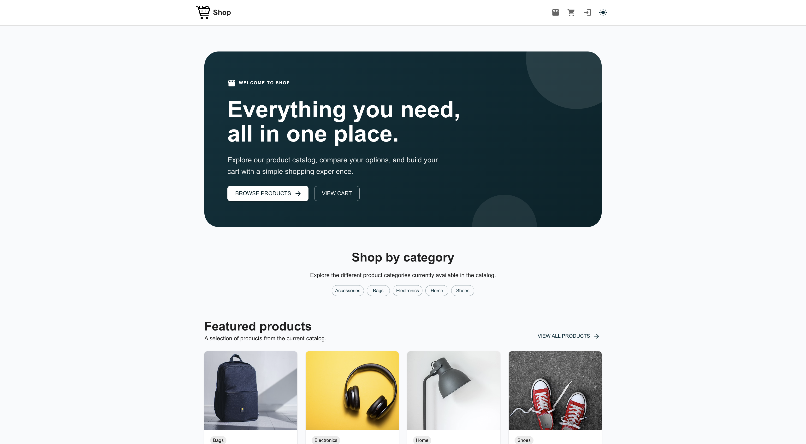
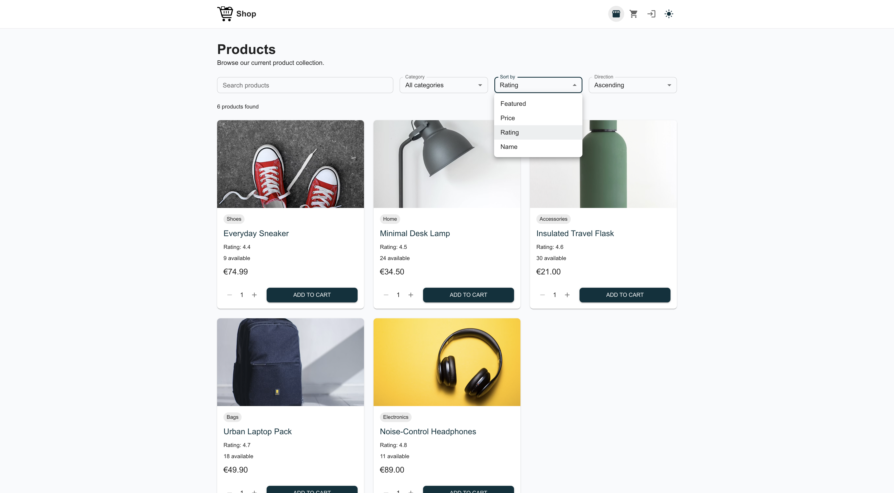
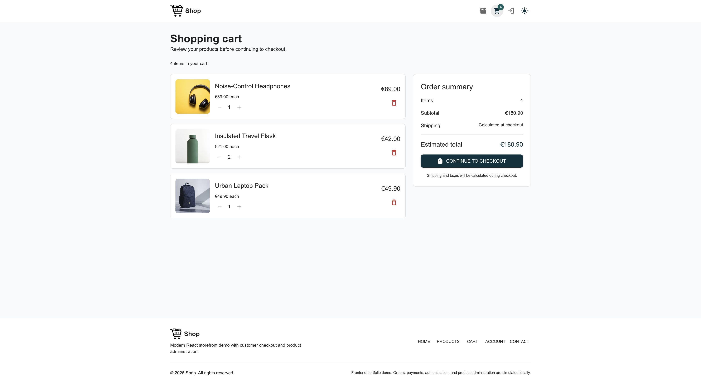
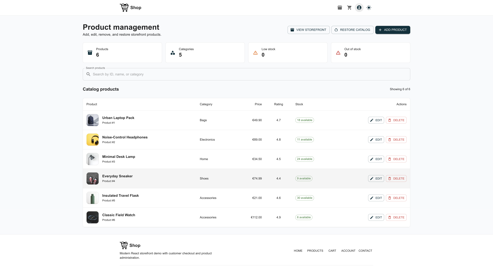

# Shop Frontend

A responsive e-commerce storefront built with React, TypeScript, Material UI, and Vite.

The project demonstrates a complete frontend shopping flow, including product browsing, customer authentication, cart management, checkout, order history, and an administrator product-management area.

All data operations are currently simulated in the browser. The application is designed so the mock services can later be replaced by a Spring Boot and PostgreSQL backend.

## Screenshots

### Storefront



### Product catalog



### Shopping cart



### Administrator dashboard



## Features

### Storefront

- Responsive home page
- Product search, filtering, sorting, and pagination
- Product details
- Stock-aware cart management
- Guest and authenticated customer carts
- Guest-cart merging after login
- Light, dark, and system color modes
- Responsive cart and account previews
- Loading, empty, error, and not-found states

### Customer account

- Registration and login
- Protected account routes
- Profile editing
- Checkout form prefilled with known customer information
- Simulated card and cash-on-delivery payments
- Order confirmation
- Order history
- Permanent order-details pages

### Administration

- Protected administrator route
- Product catalog statistics
- Product search
- Add products
- Edit products
- Delete products
- Restore the original mock catalog
- Stock and availability indicators

## Technology stack

- React
- TypeScript
- Vite
- React Router
- Material UI
- Emotion
- ESLint
- Browser `localStorage` and `sessionStorage`

## Project structure

```text
src/
├── app/
│   ├── config/          Application configuration
│   ├── providers/       Global providers
│   ├── router/          Routes and access guards
│   └── theme/           Material UI theme
├── components/
│   ├── account/         Account menu and account UI
│   ├── admin/           Product-management components
│   ├── cart/            Cart components
│   ├── checkout/        Checkout form and summary
│   ├── layout/          Headers, footer, and branding
│   ├── orders/          Shared order components
│   ├── products/        Catalog and product components
│   └── ui/              Reusable UI controls
├── hooks/               Application hooks
├── layouts/             Main, account, checkout, and admin layouts
├── mocks/               Initial mock product data
├── pages/               Route-level pages
├── services/            Service contracts and mock implementations
├── stores/              Authentication, cart, and notification state
├── types/               Shared TypeScript models
└── utils/               Formatting and small application utilities
```

## Architecture

The frontend separates the UI from data operations through service contracts:

```text
Page or component
→ Hook or store
→ Service interface
→ Mock service
→ Browser storage
```

For example:

```text
ProductsPage
→ useProducts
→ ProductService
→ mockProductService
→ localStorage
```

This allows a future API implementation to replace the mock service without rewriting the page components.

## Local data

The standalone frontend stores demonstration data in the browser.

Main storage keys include:

```text
shop.auth.users
shop.auth.session
shop.cart.guest
shop.cart.user.<userId>
shop.orders
shop.products
```

Clearing browser storage resets customer accounts, carts, orders, and product changes.

The administrator dashboard also provides a **Restore catalog** action for restoring the original product data.

## Getting started

### Requirements

- Node.js
- npm

### Installation

```bash
npm install
```

Create the local environment file:

```bash
cp .env.example .env
```

Start the development server:

```bash
npm run dev
```

Open the local address shown by Vite, usually:

```text
http://localhost:5173
```

## Demo administrator

The administrator credentials are configured through the local environment file:

```dotenv
VITE_DEMO_ADMIN_EMAIL=admin@shop.demo
VITE_DEMO_ADMIN_PASSWORD="Admin123!"
```

The login page also provides a button that prefills the demo administrator account.

These credentials are intentionally public demonstration values. Variables beginning with `VITE_` are included in the frontend bundle and must not contain real secrets.

## Available scripts

```bash
npm run dev
```

Starts the Vite development server.

```bash
npm run typecheck
```

Runs TypeScript project checking.

```bash
npm run lint
```

Runs ESLint.

```bash
npm run build
```

Runs TypeScript and creates the production build.

```bash
npm run check
```

Runs linting and the complete production build.

```bash
npm run preview
```

Serves the production build locally.

## Main routes

```text
/                                  Home
/products                          Product catalog
/products/:id                      Product details
/cart                              Shopping cart
/login                             Login
/register                          Registration
/checkout                          Protected checkout
/orders/:orderId/confirmation      Recent order confirmation
/account                           Account overview
/account/profile                   Profile
/account/orders                    Order history
/account/orders/:orderId           Order details
/admin                             Protected product management
```

## Environment configuration

Copy `.env.example` to `.env` and adjust the values locally.

Important variables include:

```dotenv
VITE_SITE_NAME=
VITE_SITE_SHORT_NAME=
VITE_SITE_DESCRIPTION=
VITE_SITE_URL=
VITE_API_BASE_URL=

VITE_LOGO_PATH=
VITE_FAVICON_PATH=
VITE_CONTACT_EMAIL=

VITE_DEMO_ADMIN_EMAIL=
VITE_DEMO_ADMIN_PASSWORD=
```

The `.env` file is ignored by Git. `.env.example` documents the required configuration and should remain committed.

## Production build

Create the production bundle:

```bash
npm run build
```

Preview it locally:

```bash
npm run preview
```

The generated files are written to:

```text
dist/
```

The deployment platform must redirect unknown application routes to `index.html` so React Router can handle direct navigation.

## Current limitations

This is a frontend-only demonstration.

The following behavior is simulated:

- Authentication
- Authorization
- Product administration
- Cart persistence
- Checkout
- Payment
- Order storage

The project does not provide production-grade security. Frontend route guards improve the user experience but cannot replace backend authorization.

## Planned full-stack version

A separate full-stack repository can replace the mock services with:

- Spring Boot REST APIs
- PostgreSQL
- Secure password hashing
- Server-side sessions or token authentication
- Role-based backend authorization
- Product and inventory persistence
- Order transactions
- Database migrations
- Docker and CI/CD
- Kubernetes, Helm, and Terraform when deployment complexity requires them

## Quality checks

Before committing changes, run:

```bash
npm run check
npm audit
```

The project currently passes:

- ESLint
- TypeScript compilation
- Vite production build
- npm dependency audit

## License

This project is intended for learning and portfolio demonstration.
